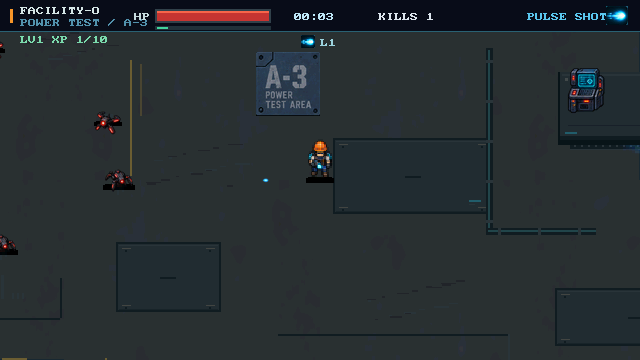
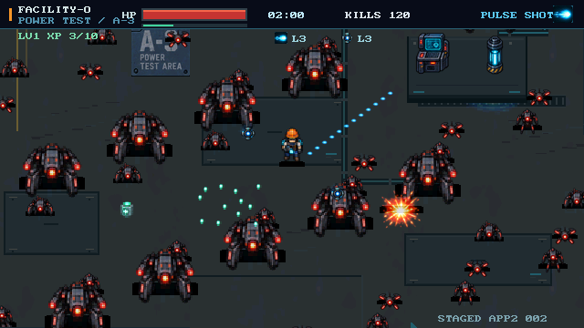
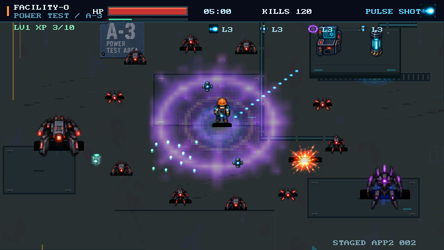
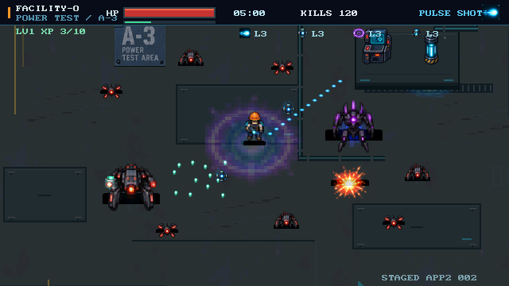
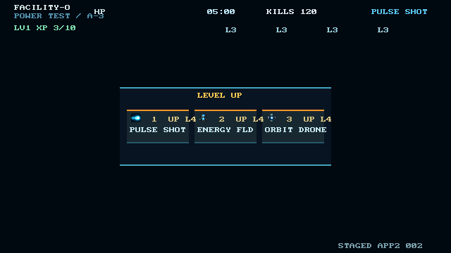
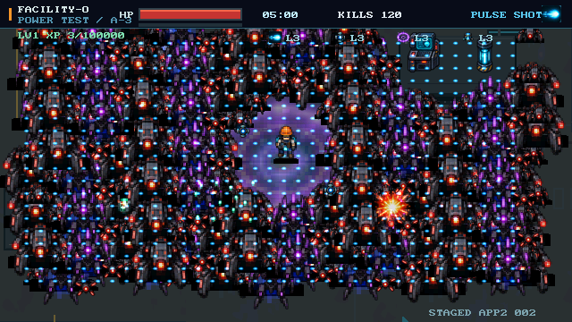
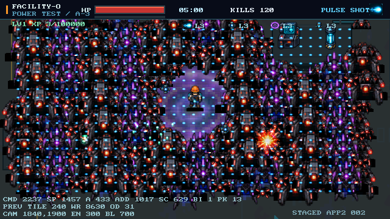
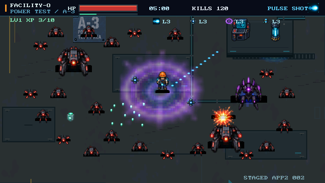

# APP2_002R 视觉审查包

2026-09-17。依据 REVIEW_APP2_002_V1，VIS-01～VIS-06 等待 owner/reviewer 判定。本地图片检查不授予阶段视觉 PASS。

用户本轮选择“交给后续正式审查”；因此此包为待审交付，不是已批准视觉证据。

交互复测：重新启动 `build/stage0045/model/pc_demo/gpu2d_demo.exe`，菜单按2进入Facility；升级按1/2/3（支持NumLock小键盘），P暂停/继续，R重置。连续升级需逐次按键完成每次选择。

全部图像为生产 Graphics API 渲染的640×360 RGB565帧转换。命令及原始帧SHA256见 captures.json。V1为正常Director、180帧空闲输入；V2～V7与showcase为人工构图，高HP不能作为正常生存平衡证据。V2只含前四敌种；V3/V4/showcase现为三组独立构图。

## V1 — 早期 Pulse、Drone/Crawler、低密度地图（VIS-01）

## V2 — Pulse/Orbit、Runner/Tank 与 XP（VIS-02）

## V3 — Nova / Field / Orbit 效果与玩家辨识（VIS-03）

## V4 — 单个 Elite 焦点与混合护卫（VIS-04）

## V5 — 三项有效构筑选择及等级（UPG-08 补充）

## V6 — 300敌人 / 700弹丸压力与中心可读性（VIS-05）

## V7 — 实体 / 混合 / 缩放 / Bilinear / Tile / WorkRefs（VIS-06）

PREV 为上一帧后端统计，其他为当前帧构造命令时的计数。PC计数不是FPGA性能。

## 独立展示候选 — STAGED SHOWCASE（VIS-06）

24敌人，包含1 Elite、2 Tank；左右不对称包围，保留玩家中心、四武器与XP。

请分别判定早期、中期、范围特效、Elite、密度可读性及展示/技术HUD。V3、V4、showcase独立像素hash仅证明构图不是重复别名，不能替代美术判断。
